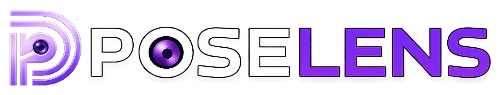

<div align="center">



# Pose Lens

### AI-Powered Photography Pose Director

**Point your camera at any scene. Get the perfect pose — instantly.**

[](https://poselens.pro.bd/)
[](LICENSE)
[](https://nextjs.org/)
[](https://github.com/websmartbd/PoseLens/pulls)

</div>

---

## Overview

**Pose Lens** is an open-source, browser-based AI photography assistant. It uses computer vision to analyze your real-world environment through your device camera and instantly suggests the most aesthetically fitting human pose — displayed as a live skeleton overlay with step-by-step instructions in **Bangla** or **English**.

No app download. No backend. No data stored on any server. Just open the URL and shoot.

---

## ✨ Features

| Feature | Description |
|---|---|
| 📸 **Dual Camera Support** | Works with both front (selfie) and back cameras |
| 🤖 **AI Pose Generation** | Analyzes the scene and generates a tailored pose in real-time |
| 🦴 **Live Skeleton Overlay** | Renders a smooth, animated silhouette directly on the camera feed |
| 🌐 **Bilingual Instructions** | Full support for **Bangla** and **English** pose directions |
| 🔑 **Bring Your Own Key** | Use your own free API keys — no vendor lock-in |
| 🔒 **100% Private** | All keys stored locally in your browser. Nothing leaves your device |
| 📱 **Mobile-First PWA** | Installable on Android and iOS, works entirely in the browser |

---

## 🚀 Getting Started

### Prerequisites

- Node.js `18+`
- A free API key from one of the [supported providers](#-supported-ai-providers--models)

### Installation

```bash
# 1. Clone the repository
git clone https://github.com/websmartbd/PoseLens.git
cd PoseLens

# 2. Install dependencies
npm install

# 3. Start the development server
npm run dev
```

Open [http://localhost:3000](http://localhost:3000) in your browser.

> **📱 Testing on mobile:** While the dev server is running, find your local IP address (e.g. `192.168.x.x`) and open `http://192.168.x.x:3000` on your phone — connected to the same Wi-Fi network.

---

## 🤖 Supported AI Providers & Models

Pose Lens works with three leading AI providers. All have free tiers.

| Provider | Recommended Model | Speed | Cost |
|---|---|---|---|
| **Google Gemini** | `gemini-2.0-flash` | Fast | Free tier |
| **Groq** | `meta-llama/llama-4-scout-17b-16e-instruct` | Very Fast | Free |
| **OpenRouter** | `nvidia/nemotron-nano-12b-v2-vl:free` | Moderate | 100% Free |

Get your free API key:
- 🔗 [Google AI Studio](https://aistudio.google.com/app/apikey)
- 🔗 [Groq Console](https://console.groq.com/keys)
- 🔗 [OpenRouter](https://openrouter.ai/keys)

---

## 🛠️ Tech Stack

| Technology | Purpose |
|---|---|
| **Next.js 16** (App Router) | Framework & SSR |
| **React 19** | UI rendering |
| **TypeScript** | Type safety |
| **Tailwind CSS v4** | Styling |
| **Canvas API** | Real-time skeleton overlay rendering |
| **Zod** | AI response schema validation |

---

## 📁 Project Structure

```
src/
├── app/                   # Next.js App Router pages & layout
├── components/
│   ├── camera/            # Camera view & pose overlay components
│   └── ui/                # Reusable UI components (Settings, ErrorBoundary)
├── config/                # App-wide constants (colors, error messages)
├── lib/                   # Core logic (AI service, prompts, skeleton drawing)
├── styles/                # Global CSS
└── types/                 # Shared TypeScript types & Zod schemas

public/
└── images/                # App icons, OG image, favicon
```

---

## 🚢 Deployment

The easiest way to deploy Pose Lens is with [Vercel](https://vercel.com). No environment variables are required — all API keys are stored client-side.

1. Fork this repository
2. Import the repo at [vercel.com/new](https://vercel.com/new)
3. Click **Deploy**

[](https://vercel.com/new/clone?repository-url=https://github.com/websmartbd/PoseLens)

**🌐 Live Demo:** [https://poselens.pro.bd/](https://poselens.pro.bd/)

---

## 🔒 Privacy

Pose Lens is designed with privacy as a first principle:

- ✅ API keys are stored **only in your browser's `localStorage`**
- ✅ Camera frames are processed **locally** before being sent to the AI provider
- ✅ **No analytics**, no user accounts, no data collection
- ✅ Fully open-source — you can verify every line of code

---

## 🤝 Contributing

Contributions are what make the open-source community great. Any contribution you make is **greatly appreciated**.

1. Fork the project
2. Create your feature branch (`git checkout -b feature/AmazingFeature`)
3. Commit your changes (`git commit -m 'Add some AmazingFeature'`)
4. Push to the branch (`git push origin feature/AmazingFeature`)
5. Open a Pull Request

Please read through the existing issues before opening a new one.

---

## 📄 License

Distributed under the **MIT License**. See [`LICENSE`](LICENSE) for more information.

---

<div align="center">

Made with ❤️ by [WebSmartBD](https://github.com/websmartbd)

⭐ Star this repo if you find it helpful!

</div>
